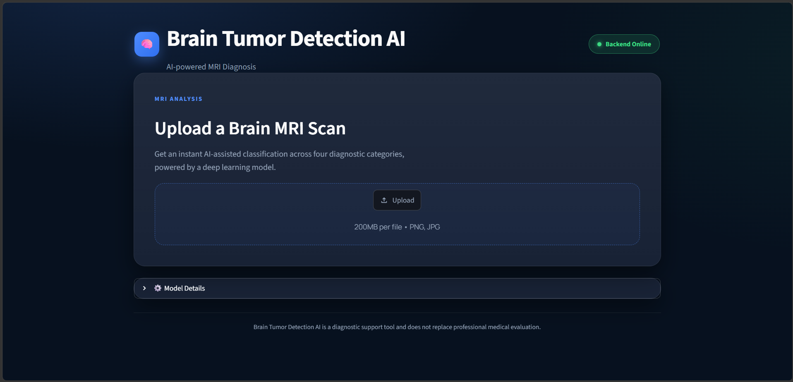
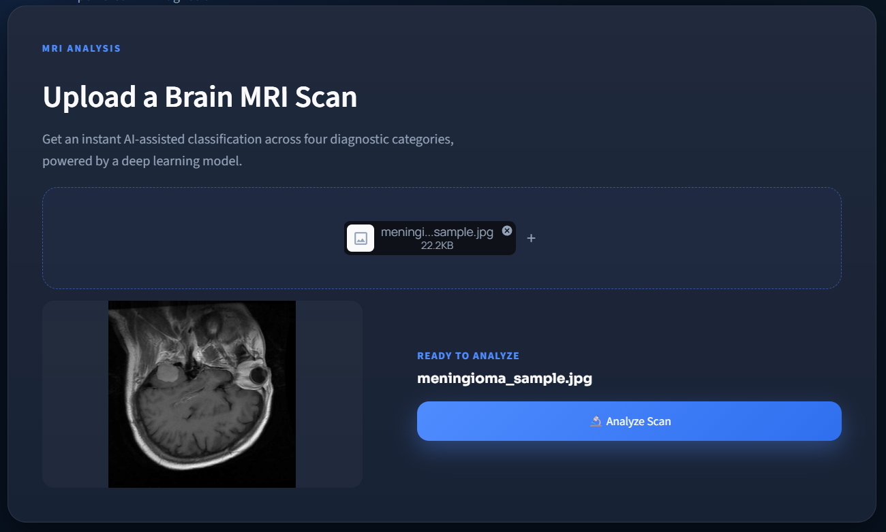
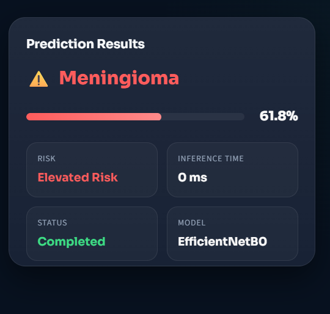
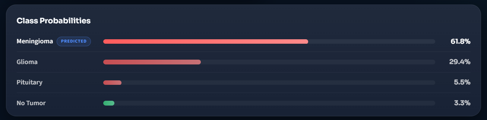
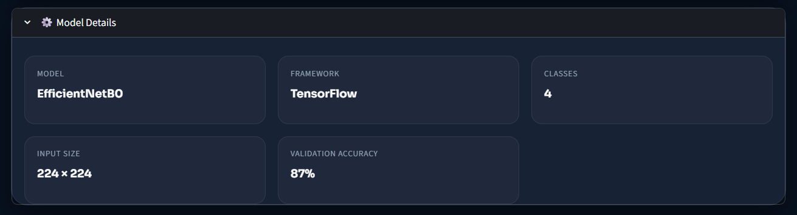
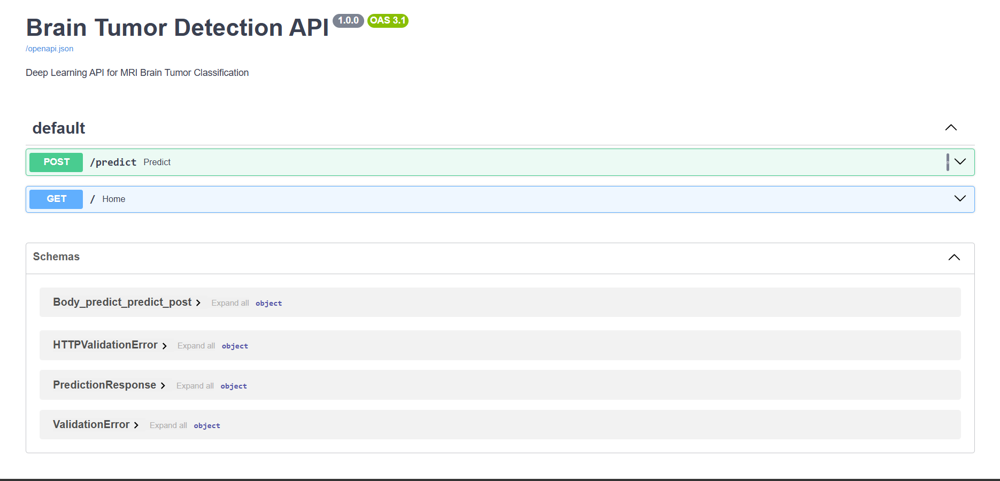
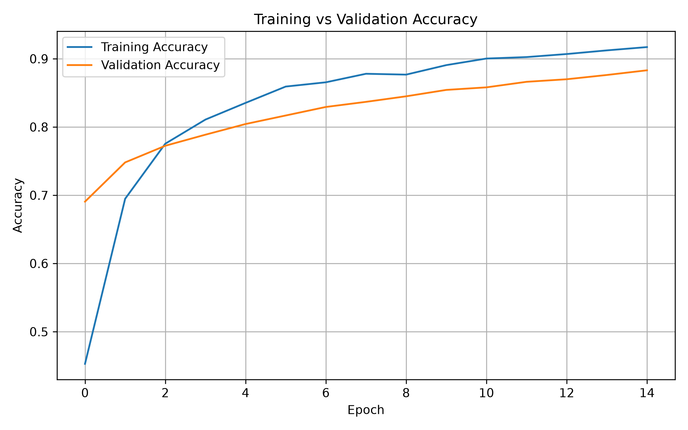
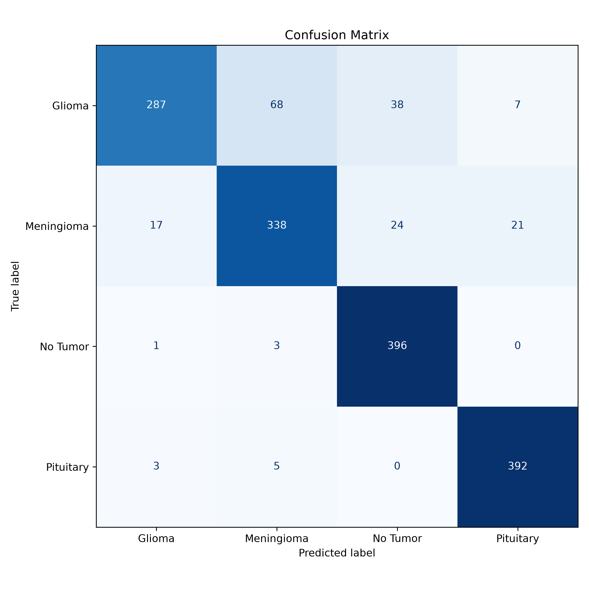

# 🧠 Brain Tumor Detection AI

<p align="center">

**An end-to-end AI-powered web application for brain tumor classification from MRI scans using Deep Learning, FastAPI, and Streamlit.**

</p>

<p align="center">


</p>

---

## 📌 Overview

Brain Tumor Detection AI is an end-to-end deep learning application that classifies brain MRI scans into one of four categories using an EfficientNetB0-based convolutional neural network.

The project demonstrates how a trained machine learning model can be integrated into a complete software system with a FastAPI backend for model inference and a Streamlit frontend for an interactive user experience.

Rather than existing only as a Jupyter notebook, this project follows a modular architecture that separates model training, inference, backend services, and frontend components, making it easier to maintain, extend, and deploy.

> **Disclaimer**
>
> This application is intended for educational and portfolio purposes only. It is **not** a medical diagnostic tool and should not be used for clinical decision-making.

---

# ✨ Key Features

This project combines deep learning with modern web technologies to deliver a complete AI-powered application for brain MRI classification.

### 🧠 AI-Powered Tumor Classification

- Classifies brain MRI scans into **four diagnostic categories**:
  - Glioma
  - Meningioma
  - Pituitary Tumor
  - No Tumor
- Powered by an **EfficientNetB0** deep learning model using transfer learning.
- Returns the predicted class along with confidence scores for all categories.

---

### 🌐 FastAPI Backend

- RESTful API for real-time predictions.
- Modular inference pipeline for preprocessing, prediction, and postprocessing.
- Structured JSON responses using Pydantic models.
- Automatic interactive API documentation with Swagger UI.

---

### 🎨 Interactive Streamlit Frontend

- Clean and user-friendly interface.
- Upload MRI images directly from the browser.
- Instant prediction results.
- Displays confidence scores and probability distribution.
- Responsive dashboard with reusable UI components.

---

### ⚙️ Production-Inspired Architecture

- Clear separation of frontend, backend, and model training.
- Modular codebase for easier maintenance and future enhancements.
- Independent training and inference pipelines.
- Designed with software engineering best practices.

---

## 🎬 Application Workflow

```text
                Upload MRI Scan
                       │
                       ▼
             Streamlit Frontend
                       │
              HTTP POST Request
                       │
                       ▼
               FastAPI Backend
                       │
                Inference Pipeline
        ┌─────────┬─────────┬─────────┐
        ▼         ▼         ▼
  Preprocess   Predict   Postprocess
                       │
                       ▼
            Brain Tumor Prediction
                       │
                       ▼
        Prediction Dashboard & Confidence
```

---

## 🚀 Key Highlights

- ✅ End-to-end AI application
- ✅ Deep learning with TensorFlow & EfficientNetB0
- ✅ FastAPI REST API
- ✅ Interactive Streamlit dashboard
- ✅ Modular and scalable architecture
- ✅ Real-time MRI image classification
- ✅ Clean project structure
- ✅ Suitable for learning, portfolio, and demonstration purposes

# 📸 Application Preview

See the complete workflow of the Brain Tumor Detection AI application—from uploading an MRI scan to receiving an AI-powered prediction.

---

## 🏠 Home Dashboard

The home page provides a clean and intuitive interface where users can upload an MRI scan and start the analysis with a single click.

<p align="center">

</p>

---

## 📤 MRI Image Upload

Users can upload MRI images in supported formats. The application validates the file before sending it to the backend for inference.

<p align="center">

</p>

---

## 🧠 Prediction Results

After processing the uploaded MRI image, the application displays:

- Predicted tumor class
- Confidence score
- AI-generated clinical summary

<p align="center">

</p>

---

## 📊 Confidence Distribution

To improve prediction transparency, the confidence score for each tumor category is displayed as an easy-to-read probability chart.

<p align="center">

</p>

---

## 🤖 Model Information

The dashboard also provides information about the trained model, including the architecture, input size, and performance metrics.

<p align="center">

</p>

---

## 🌐 FastAPI Interactive Documentation

FastAPI automatically generates interactive API documentation, allowing developers to test endpoints directly from the browser.

<p align="center">

</p>

---

## 🎥 Application Demo

The following GIF demonstrates the complete workflow of the application.

<p align="center">

</p>

# 🏗️ System Architecture

The Brain Tumor Detection AI application follows a modular, production-inspired architecture that separates the user interface, backend services, and machine learning components. This design improves maintainability, scalability, and makes each layer independently testable.

The workflow begins when a user uploads an MRI scan through the Streamlit frontend. The image is sent to the FastAPI backend, where it passes through a dedicated inference pipeline consisting of preprocessing, model inference, and postprocessing. The prediction is then returned to the frontend and presented in a user-friendly format.

---

## Overall Architecture

```text
                           User
                             │
                             ▼
                 Streamlit Frontend
                             │
                    Upload MRI Scan
                             │
                             ▼
                 FastAPI REST Backend
                             │
                             ▼
                  Inference Pipeline
       ┌──────────────┬──────────────┬──────────────┐
       ▼              ▼              ▼
 Image Preprocessing  Model Prediction  Result Processing
       │              │              │
       └──────────────┴──────────────┘
                      │
                      ▼
             Prediction Response (JSON)
                      │
                      ▼
              Interactive Dashboard
```

---

## Architecture Layers

### 🎨 Presentation Layer

The Streamlit frontend provides a clean and interactive interface where users can:

- Upload brain MRI scans
- View prediction results
- Analyze confidence scores
- Read AI-generated summaries

This layer focuses entirely on user interaction and visualization.

---

### ⚙️ Application Layer

The FastAPI backend acts as the communication bridge between the frontend and the AI model.

Its responsibilities include:

- Receiving uploaded MRI images
- Validating incoming requests
- Triggering the inference pipeline
- Returning structured JSON responses
- Providing automatic Swagger API documentation

---

### 🧠 AI Inference Layer

The inference layer is responsible for generating predictions using the trained deep learning model.

The workflow consists of:

1. Image preprocessing
2. Model loading
3. Prediction
4. Postprocessing
5. Response generation

Each stage is implemented as an independent module, making the pipeline easier to understand and maintain.

---

### 🤖 Machine Learning Layer

This layer contains the trained EfficientNetB0 model used for tumor classification.

The model was trained using transfer learning and fine-tuned on a brain MRI dataset to classify images into four categories:

- Glioma
- Meningioma
- Pituitary Tumor
- No Tumor

---

## End-to-End Workflow

```text
MRI Scan
    │
    ▼
Upload Image
    │
    ▼
Frontend (Streamlit)
    │
    ▼
FastAPI Endpoint
    │
    ▼
Image Preprocessing
    │
    ▼
EfficientNetB0 Model
    │
    ▼
Prediction & Confidence
    │
    ▼
JSON Response
    │
    ▼
Frontend Dashboard
```

---

## Design Principles

The project was developed using software engineering principles that make the application easier to maintain and extend.

- **Modularity** – Each component has a single responsibility.
- **Separation of Concerns** – Frontend, backend, and AI logic are isolated.
- **Reusability** – Core modules can be reused in future projects.
- **Scalability** – The architecture supports future enhancements such as authentication, cloud deployment, explainable AI, and model versioning.
- **Maintainability** – A structured codebase simplifies debugging, testing, and future development.

# 🛠️ Technology Stack

The project combines modern deep learning frameworks with robust backend technologies and an interactive frontend to deliver a complete end-to-end AI application.

---

## 🧠 Artificial Intelligence & Machine Learning

| Technology         | Purpose                                                    |
| ------------------ | ---------------------------------------------------------- |
| **TensorFlow**     | Build, train, and deploy the deep learning model           |
| **Keras**          | High-level API for designing and training neural networks  |
| **EfficientNetB0** | Transfer learning model for brain MRI image classification |
| **NumPy**          | Numerical computations and tensor manipulation             |

---

## 👁️ Computer Vision

| Technology       | Purpose                                  |
| ---------------- | ---------------------------------------- |
| **OpenCV**       | Image preprocessing and manipulation     |
| **Pillow (PIL)** | Reading and handling uploaded MRI images |

---

## ⚙️ Backend Development

| Technology   | Purpose                                         |
| ------------ | ----------------------------------------------- |
| **FastAPI**  | High-performance REST API framework             |
| **Uvicorn**  | ASGI server for running the FastAPI application |
| **Pydantic** | Request validation and structured API responses |

---

## 🎨 Frontend Development

| Technology    | Purpose                                               |
| ------------- | ----------------------------------------------------- |
| **Streamlit** | Interactive web application for model inference       |
| **HTML**      | Custom UI components                                  |
| **CSS**       | Application styling and responsive layout             |
| **Plotly**    | Interactive confidence and probability visualizations |

---

## 📊 Data Analysis & Visualization

| Technology       | Purpose                                                               |
| ---------------- | --------------------------------------------------------------------- |
| **Matplotlib**   | Training and evaluation visualizations                                |
| **Scikit-learn** | Model evaluation metrics, confusion matrix, and classification report |

---

## 🧰 Development Tools

| Technology                            | Purpose                                         |
| ------------------------------------- | ----------------------------------------------- |
| **Git**                               | Version control                                 |
| **GitHub**                            | Source code hosting and collaboration           |
| **Python Virtual Environment (venv)** | Dependency isolation and environment management |

---

## 📌 Why This Stack?

Each technology was selected to address a specific aspect of the project:

- **TensorFlow & Keras** power the deep learning model for brain MRI classification.
- **FastAPI** provides a fast and lightweight backend for serving predictions.
- **Streamlit** enables rapid development of an intuitive user interface.
- **OpenCV** and **Pillow** handle image preprocessing before inference.
- **Scikit-learn** is used to evaluate model performance with industry-standard metrics.
- **Git & GitHub** support version control and project management.

Together, these technologies create a scalable, modular, and maintainable AI application that demonstrates the integration of machine learning with modern software engineering practices.

# 📂 Project Structure

The project is organized into independent modules, separating machine learning, backend services, and frontend components. This modular design improves readability, maintainability, and allows each part of the application to evolve independently.

```text
brain-tumor-detection-ai/
│
├── backend/                  # FastAPI backend application
│   ├── api/                  # REST API endpoints
│   ├── inference/            # AI inference pipeline
│   ├── schema/               # Pydantic request & response models
│   ├── app.py                # FastAPI application entry point
│   └── config.py             # Application configuration
│
├── frontend/                 # Streamlit web application
│   ├── api/                  # Backend API client
│   ├── components/           # Reusable UI components
│   ├── styles/               # Custom CSS styles
│   ├── utils/                # Helper utilities
│   └── app.py                # Streamlit application entry point
│
├── model_training/           # Model training and evaluation pipeline
│   ├── analysis/
│   ├── configs/
│   ├── data_loader/
│   ├── evaluation/
│   ├── models/
│   ├── preprocessing/
│   ├── training/
│   ├── utils/
│   └── tests/
│
├── assets/                   # Screenshots, banner, and demo GIF
│
├── README.md                 # Project documentation
├── requirements.txt          # Python dependencies
├── .gitignore
└── LICENSE
```

---

## 📁 Directory Overview

### ⚙️ `backend/`

Implements the REST API and handles all inference requests. It receives uploaded MRI images, executes the prediction pipeline, and returns structured JSON responses.

**Responsibilities**

- Serve prediction endpoints
- Validate uploaded images
- Run the inference pipeline
- Return prediction results

---

### 🎨 `frontend/`

Provides the user interface built with Streamlit. Users can upload MRI images, view predictions, confidence scores, and model information through an interactive dashboard.

**Responsibilities**

- User interaction
- Image upload
- Display prediction results
- Visualize confidence scores

---

### 🧠 `model_training/`

Contains the complete machine learning workflow used to develop the classification model.

**Responsibilities**

- Dataset preparation
- Image preprocessing
- Model training
- Fine-tuning
- Evaluation
- Model export

> **Note:** This module is used during model development and is not required when running the deployed application.

---

### 🖼️ `assets/`

Stores all visual resources used in the repository.

Examples include:

- README banner
- Application screenshots
- Demo GIF
- Architecture diagrams

Keeping these files in a dedicated folder makes the repository clean and easy to maintain.

---

## 🏛️ Project Organization

The repository is divided into three main layers:

```text
Presentation Layer
        │
        ▼
Frontend (Streamlit)

        │
        ▼

Application Layer
        │
        ▼
Backend (FastAPI)

        │
        ▼

AI Layer
        │
        ▼
EfficientNetB0 Model
```

This separation ensures that changes in one layer have minimal impact on the others, making the project easier to test, maintain, and extend.

---

## 📌 Key Design Principles

- **Modular Architecture** – Each module has a single, well-defined responsibility.
- **Separation of Concerns** – Frontend, backend, and AI logic are kept independent.
- **Scalability** – The structure supports future enhancements such as authentication, explainable AI, or cloud deployment.
- **Maintainability** – Organized directories and reusable components simplify future development.

# 🤖 Deep Learning Model

The Brain Tumor Detection AI application is powered by **EfficientNetB0**, a state-of-the-art convolutional neural network designed for image classification tasks. By leveraging **transfer learning**, the model achieves strong performance while requiring significantly less training time compared to building a CNN from scratch.

The trained model classifies brain MRI scans into one of four categories:

| Class         | Description                                                            |
| ------------- | ---------------------------------------------------------------------- |
| 🧠 Glioma     | Tumors originating from the brain's glial cells.                       |
| 🧠 Meningioma | Tumors that develop in the protective membranes surrounding the brain. |
| 🧠 Pituitary  | Tumors affecting the pituitary gland.                                  |
| ✅ No Tumor   | MRI scans with no detectable brain tumor.                              |

---

## 🏗️ Model Architecture

**Base Model:** EfficientNetB0

**Framework:** TensorFlow / Keras

**Input Size:** 224 × 224 × 3

**Number of Classes:** 4

**Transfer Learning:** Yes

**Fine-Tuning:** Yes

---

## 🔄 Training Pipeline

The model training process follows a structured workflow to ensure consistent and reliable performance.

```text
Brain MRI Dataset
        │
        ▼
Image Preprocessing
        │
        ▼
Data Augmentation
        │
        ▼
Transfer Learning
        │
        ▼
Model Training
        │
        ▼
Fine-Tuning
        │
        ▼
Model Evaluation
        │
        ▼
Best Model Saved
```

---

## 🖼️ Image Preprocessing

Before training and inference, every MRI image undergoes the following preprocessing steps:

- Resize images to **224 × 224** pixels.
- Convert images into RGB format.
- Normalize pixel values.
- Convert images into TensorFlow tensors.
- Add a batch dimension before prediction.

This preprocessing ensures that every image matches the input format expected by the trained model.

---

## 📊 Dataset

The model was trained on a publicly available brain MRI dataset consisting of four categories:

- Glioma
- Meningioma
- Pituitary Tumor
- No Tumor

The dataset was divided into separate **training** and **testing** sets to evaluate the model's ability to generalize to unseen MRI scans.

---

## 📈 Model Performance

The final trained model achieved the following performance on the test dataset:

| Metric            |          Value |
| ----------------- | -------------: |
| Model             | EfficientNetB0 |
| Test Accuracy     |     **87.69%** |
| Number of Classes |              4 |
| Input Size        |      224 × 224 |

In addition to overall accuracy, the model was evaluated using precision, recall, F1-score, and a confusion matrix to assess its performance across all tumor categories.

---

## 💾 Model Deployment

After training, the best-performing model is exported and loaded by the FastAPI backend during application startup.

This approach eliminates the need to retrain the model every time the application runs, enabling fast and efficient real-time predictions.

```text
Training
     │
     ▼
Best Model
     │
     ▼
Model Export
     │
     ▼
FastAPI Backend
     │
     ▼
Real-Time Inference
```

# 📊 Model Performance & Evaluation

The model was evaluated on an independent test dataset to assess its ability to classify unseen brain MRI scans. Performance was measured using multiple evaluation metrics, including accuracy, precision, recall, F1-score, and a confusion matrix.

---

## 🎯 Performance Summary

| Metric                 |              Value |
| ---------------------- | -----------------: |
| **Model Architecture** |     EfficientNetB0 |
| **Framework**          | TensorFlow / Keras |
| **Number of Classes**  |                  4 |
| **Input Image Size**   |          224 × 224 |
| **Test Accuracy**      |         **87.69%** |

The model demonstrates strong generalization performance and effectively distinguishes between four brain MRI categories while maintaining reliable prediction accuracy on unseen data.

---

## 📈 Training Performance

The figure below illustrates the training and validation accuracy over multiple epochs.

<p align="center">

</p>

### Observations

- Training accuracy steadily increased throughout the training process.
- Validation accuracy improved consistently, indicating effective learning.
- The relatively small gap between the training and validation curves suggests that the model generalizes well with minimal overfitting.

---

## 📋 Classification Report

| Class      | Precision | Recall | F1-Score |
| ---------- | --------: | -----: | -------: |
| Glioma     |      0.91 |   0.69 |     0.79 |
| Meningioma |      0.82 |   0.91 |     0.86 |
| No Tumor   |      0.85 |   1.00 |     0.92 |
| Pituitary  |      0.95 |   0.91 |     0.93 |

Overall Test Accuracy:

```text
87.69%
```

---

## 🔲 Confusion Matrix

The confusion matrix provides a detailed view of the model's predictions across all four tumor categories.

<p align="center">

</p>

### Interpretation

- **No Tumor** achieved the highest classification accuracy, with very few misclassifications.
- **Pituitary Tumors** were recognized with high precision and recall.
- The majority of prediction errors occurred between **Glioma** and **Meningioma**, reflecting the visual similarity of these tumor types in MRI scans.
- Overall, the model shows balanced performance across all classes.

---

## 💡 Key Takeaways

- ✅ Achieved **87.69%** test accuracy using EfficientNetB0.
- ✅ Successfully classifies MRI scans into four diagnostic categories.
- ✅ Produces confidence scores for every prediction.
- ✅ Demonstrates the effectiveness of transfer learning for medical image classification.
- ✅ Built as an end-to-end AI application with a modular FastAPI backend and Streamlit frontend.

# ⚙️ Installation & Setup

Follow the steps below to set up and run the project locally.

---

## 📋 Prerequisites

Before getting started, ensure the following software is installed on your system:

- Python 3.12 or later
- Git
- pip
- Virtual Environment (venv)

Verify your installation:

```bash
python --version
pip --version
git --version
```

---

## 📥 Clone the Repository

```bash
git clone https://github.com/rajashik-web/brain-tumor-detection-ai.git

cd brain-tumor-detection-ai
```

---

## 🐍 Create a Virtual Environment

### Windows

```bash
python -m venv .venv
```

Activate the environment:

```bash
.venv\Scripts\activate
```

### Linux / macOS

```bash
python3 -m venv .venv

source .venv/bin/activate
```

---

## 📦 Install Dependencies

```bash
pip install -r requirements.txt
```

This installs all required libraries, including TensorFlow, FastAPI, Streamlit, OpenCV, and other project dependencies.

---

# ▶️ Running the Application

The application consists of two independent services:

1. FastAPI Backend
2. Streamlit Frontend

Both must be running for the application to work correctly.

---

## 🚀 Step 1 — Start the Backend

Open a terminal inside the project directory and run:

```bash
uvicorn backend.app:app --reload
```

If the server starts successfully, you should see:

```text
INFO:     Uvicorn running on http://127.0.0.1:8000
```

The backend API will now be available at:

```text
http://127.0.0.1:8000
```

---

## 🌐 Step 2 — Start the Frontend

Open a **new terminal**, activate the virtual environment again, and run:

```bash
streamlit run frontend/app.py
```

After a few seconds, Streamlit will automatically open in your default web browser.

If it doesn't open automatically, visit:

```text
http://localhost:8501
```

---

## 🧪 Verify the Setup

After both services are running:

1. Open the Streamlit application.
2. Upload a brain MRI image.
3. Click **Analyze**.
4. Wait for the prediction.
5. Review the predicted class, confidence score, and probability distribution.

If everything is configured correctly, the application should successfully classify the uploaded MRI scan.

---

## 📖 API Documentation

FastAPI automatically generates interactive API documentation.

Open the following URL in your browser:

```text
http://127.0.0.1:8000/docs
```

Using Swagger UI, you can:

- Test API endpoints
- Upload MRI images
- View JSON responses
- Explore request and response schemas

---

## 🛠 Troubleshooting

### ModuleNotFoundError

Ensure the virtual environment is activated and install the dependencies again:

```bash
pip install -r requirements.txt
```

---

### Backend Not Running

Verify that Uvicorn is installed:

```bash
pip install uvicorn
```

Then restart the backend.

---

### Frontend Cannot Connect to Backend

Ensure:

- FastAPI is running on port **8000**
- The backend URL configured in the frontend matches the running server

---

### Invalid Image Error

Ensure the uploaded file is a valid brain MRI image in one of the supported formats.

---

## ✅ Setup Complete

Once both the backend and frontend are running, the application is ready for real-time brain tumor classification using MRI images.

# 📡 API Documentation

The backend exposes a RESTful API built with **FastAPI**, allowing the frontend (or any external client) to interact with the trained deep learning model for real-time brain MRI classification.

FastAPI also provides interactive API documentation through Swagger UI, making it easy to test endpoints directly from the browser.

---

## 🌐 Base URL

When running locally, the backend is available at:

```text
http://127.0.0.1:8000
```

Interactive API Documentation:

```text
http://127.0.0.1:8000/docs
```

---

# 🔍 Predict Brain Tumor

Predict the tumor category from an uploaded brain MRI image.

### Endpoint

```http
POST /predict
```

### Content Type

```text
multipart/form-data
```

---

## Request Parameters

| Parameter | Type       | Required | Description                    |
| --------- | ---------- | :------: | ------------------------------ |
| `file`    | Image File |    ✅    | Brain MRI image for prediction |

---

## Example Request

Using **cURL**:

```bash
curl -X POST \
"http://127.0.0.1:8000/predict" \
-F "file=@brain_mri.jpg"
```

---

## Successful Response

**Status Code**

```text
200 OK
```

**Response Body**

```json
{
  "prediction": "Glioma",
  "confidence": 97.3,
  "probabilities": {
    "glioma": 97.3,
    "meningioma": 1.5,
    "pituitary": 0.8,
    "notumor": 0.4
  }
}
```

---

## Response Fields

| Field           | Type   | Description                        |
| --------------- | ------ | ---------------------------------- |
| `prediction`    | String | Predicted tumor class              |
| `confidence`    | Float  | Confidence score (%)               |
| `probabilities` | Object | Confidence for each tumor category |

---

## Error Responses

| Status Code | Description                       |
| ----------: | --------------------------------- |
|     **400** | Invalid image or unsupported file |
|     **404** | Endpoint not found                |
|     **422** | Validation error                  |
|     **500** | Internal server error             |

Example error response:

```json
{
  "detail": "Invalid image file."
}
```

---

# 🔄 Request Lifecycle

```text
Client
   │
   ▼
Upload MRI Image
   │
   ▼
POST /predict
   │
   ▼
FastAPI Backend
   │
   ▼
Image Validation
   │
   ▼
Inference Pipeline
   │
   ▼
Prediction Generated
   │
   ▼
JSON Response
   │
   ▼
Frontend Dashboard
```

---

## 🧪 Testing with Swagger UI

FastAPI automatically generates an interactive API interface.

After starting the backend:

1. Open **http://127.0.0.1:8000/docs**
2. Select the **POST /predict** endpoint.
3. Click **Try it out**.
4. Upload an MRI image.
5. Click **Execute**.
6. View the prediction response.

This interface is useful for testing the backend independently of the Streamlit frontend.

# 🚀 Future Improvements

While the current application provides a complete end-to-end workflow for brain MRI classification, there are several opportunities to enhance its functionality, usability, and real-world applicability.

---

## 🧠 Machine Learning Enhancements

Future versions of the model could focus on improving prediction accuracy and robustness by incorporating more advanced deep learning techniques.

Possible improvements include:

- Train on a larger and more diverse MRI dataset.
- Experiment with modern architectures such as **EfficientNetV2**, **ConvNeXt**, and **Vision Transformers (ViT)**.
- Perform hyperparameter optimization to improve model performance.
- Address class imbalance using advanced sampling techniques.
- Improve generalization through enhanced data augmentation strategies.

---

## 🔬 Explainable AI (XAI)

Medical AI systems should provide transparency alongside predictions.

Future versions of this project may include:

- Grad-CAM visualization
- Saliency maps
- Attention heatmaps
- Feature activation visualization

These techniques would help users understand which regions of an MRI scan influenced the model's prediction.

---

## ⚙️ Backend Improvements

The backend can be extended with additional production-ready capabilities, including:

- JWT-based authentication
- Prediction history
- Database integration
- Batch image prediction
- Request logging
- Model version management
- Rate limiting
- Docker support
- Cloud deployment

---

## 🎨 Frontend Improvements

The user interface can be enhanced to provide a richer user experience.

Potential improvements include:

- Dark mode
- Drag-and-drop image upload
- Multi-image prediction
- Prediction history dashboard
- Downloadable PDF reports
- Responsive mobile layout
- Accessibility improvements

---

## ☁️ Deployment

Future releases could make the application publicly accessible through cloud platforms such as:

- Docker
- AWS
- Microsoft Azure
- Google Cloud Platform (GCP)
- Hugging Face Spaces

---

## 📈 Continuous Improvement

As additional datasets become available, the model can be retrained and evaluated to improve prediction performance and support a wider variety of medical imaging scenarios.

The modular architecture of this project makes it straightforward to integrate new models, backend services, and frontend features without requiring major changes to the existing codebase.

# 👨‍💻 Author

## Ashik Raj

**Artificial Intelligence & Machine Learning Engineering Student**

I enjoy building end-to-end AI applications that combine machine learning, backend development, and intuitive user interfaces. My goal is to create practical AI solutions while continuously improving my skills in deep learning, software engineering, and MLOps.

---

## 📬 Connect With Me

<p align="left">

<a href="https://github.com/rajashik-web">

</a>

<a href="https://www.linkedin.com/feed/">

</a>

<a href="ashikraj182005@gmail.com">

</a>

---

# 📄 License

This project is licensed under the **MIT License**.

You are free to use, modify, and distribute this project in accordance with the terms of the license.

For more information, see the **LICENSE** file included in this repository.

---

# 🙏 Acknowledgements

This project was developed using several outstanding open-source technologies.

Special thanks to the communities behind:

- TensorFlow
- Keras
- FastAPI
- Streamlit
- OpenCV
- NumPy
- Scikit-learn
- Matplotlib

Their contributions make modern AI development more accessible to developers, researchers, and students worldwide.

---

# ⭐ Support the Project

If you found this project helpful or interesting, consider supporting it by:

- ⭐ Starring the repository
- 🍴 Forking the project
- 🐛 Reporting bugs or issues
- 💡 Suggesting improvements
- 🔀 Opening a pull request

Your feedback and contributions are always welcome.

---

# 🎯 Project Summary

Brain Tumor Detection AI demonstrates how a deep learning model can be transformed into a complete AI application by integrating machine learning, backend development, and an interactive user interface.

The project combines **TensorFlow**, **FastAPI**, and **Streamlit** to deliver a modular, maintainable, and user-friendly system capable of classifying brain MRI scans into four diagnostic categories.

Beyond the prediction model itself, this project emphasizes software engineering best practices, including modular architecture, separation of concerns, reusable components, and clear technical documentation.

Thank you for taking the time to explore this project!
